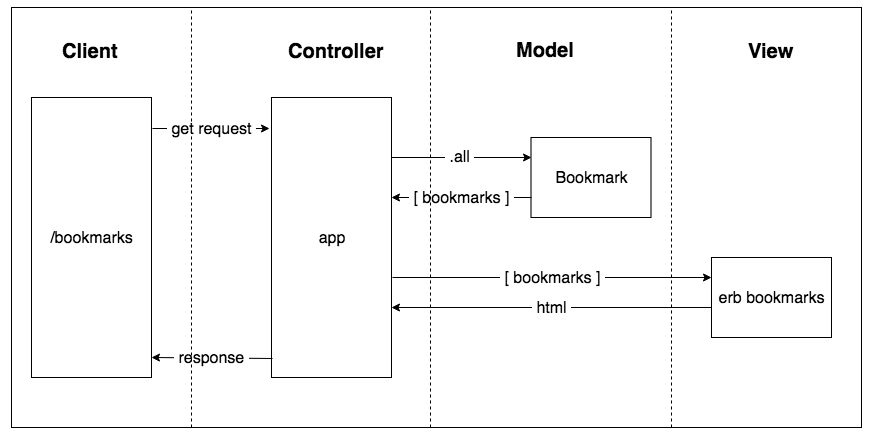

User Story 1

As a time-pressed user
So that I can quickly go to web sites I regularly visit
I would like to see a list of bookmarks



## How to use
### To set up the project
Clone this repository and then run:
```
bundle install
```

### To set up the database

Connect to `psql` and create the `bookmark_manager` database:

```
CREATE DATABASE bookmark_manager;
```

To set up the appropriate tables, connect to the database using the pqsl command ``\c bookmark_manager` and run the SQL scripts we have saved in the file `01_create_bookmarks_table.sql`
